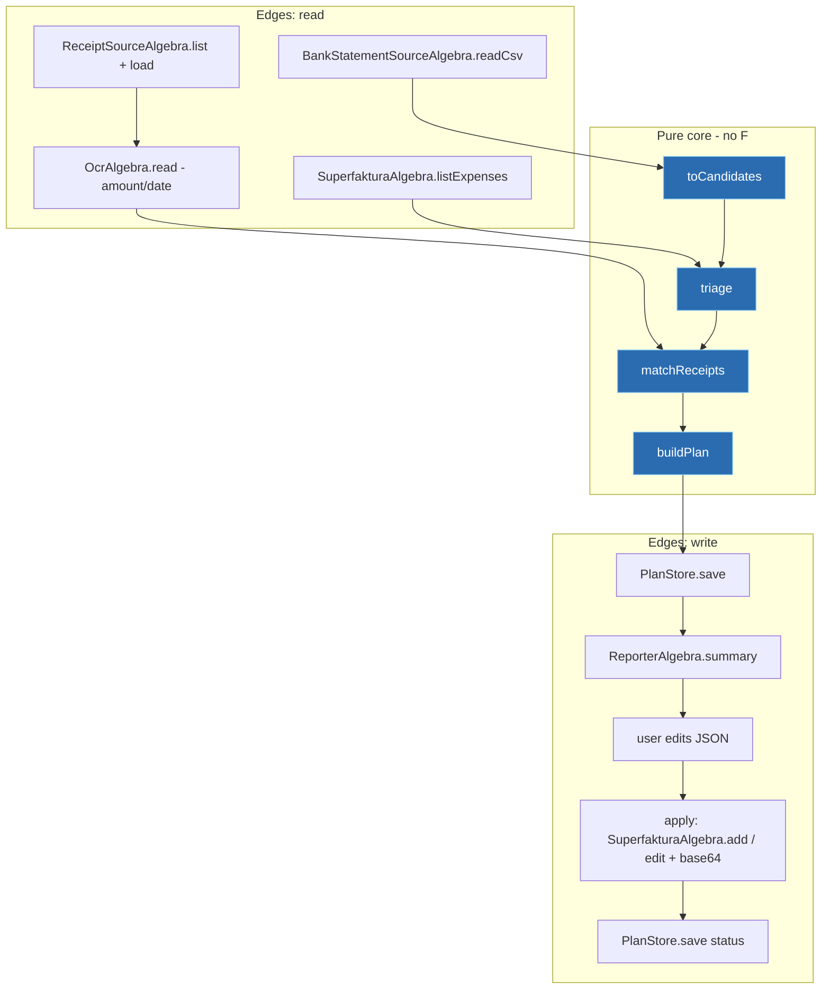

# superfaktura-batteries — Project Design Requirements

> [!NOTE]
> Status: Draft v3 (Scala) · Author: mvk@famly.co · Date: 2026-06-19.
> Supersedes the earlier TypeScript/Effect-TS draft. The stack is now Scala 3 + cats-effect, per the conventions in
> [`CLAUDE.md`](../CLAUDE.md) and [`REVIEW.md`](../REVIEW.md).

## Summary

A command-line tool that automates business bookkeeping against the
[Superfaktura.sk](https://www.superfaktura.sk) API ([docs](https://github.com/superfaktura/docs)). It:

- **Creates expenses** in Superfaktura from a Tatra banka transaction-export CSV.
- **Attaches receipts/invoices** (PDF / JPG / PNG / HEIC) from a local folder to the correct expenses — newly created
  ones or ones that already exist in Superfaktura.
- **Rewrites expense names and attaches fixed files via optional rules** (`--rules`): a small JSON rule database keyed
  on transaction name or recipient IBAN renames expenses (with a `{date}` placeholder) and/or attaches a specific file
  (see [Name-rewrite & fixed-attachment rules](#name-rewrite--fixed-attachment-rules)).
- Operates **plan-first**: it analyses inputs and emits exactly what it will do (how many expenses, names/amounts,
  which files attach where, which look like duplicates); the user reviews/edits; only then does it mutate anything.

The two capabilities compose. Because the Superfaktura API carries the attachment **inside** the expense-create call
(see [Attachments](#attachments-base64-inside-the-expense-call)), "create expense and attach its receipt" is a single
operation. Expenses always come from a CSV (`--csv` is required); receipt pairing (`--receipts`) is an optional add-on,
and within a run a receipt attaches to either a newly-created expense or one already in Superfaktura.

## Design principles (load-bearing)

These derive directly from [`CLAUDE.md`](../CLAUDE.md) and constrain every later section.

- **Pure functions first.** All business logic — parsing rows into candidates, duplicate detection, the
  receipt matching, building the plan — is expressed as pure, total functions over immutable `case class` /
  `enum` data. No side effects, no clock, no randomness, no throwing in the core.
- **All side effects live in `F[_]`.** Effectful work (reading files, HTTP, writing the plan, prompting the user) is
  never performed outside an effect. The concrete effect (`IO`) appears only at the entry point.
- **Tagless final for every effectful dependency.** Each external concern is a `trait Algebra[F[_]]` with
  companion-object constructors. Collaborators are passed via `using` clauses (`given` instances), not threaded through
  method signatures. New abstractions are `F[_]`-polymorphic.
- **Errors via `MonadThrow` / `ApplicativeThrow`.** Domain failures are a single small `enum CliError extends
  Exception` (e.g. `ConfigInvalid`, `Api(status, body)`, `PlanInvalid`), raised through the error type classes; values
  are extracted from `F[Option]`/`F[Either]` with cats stdlib (`.liftTo`, `OptionT`), not a bespoke syntax layer. Error
  combinators are ordered extraction → retry → recovery. The pure core never throws — it returns data.
- **Validate only at boundaries.** Untrusted input (CSV, API JSON, the edited plan file) is decoded with Circe at the
  edge into trusted domain types. The core trusts its inputs and does not re-validate. Boundary parsers return
  `Either[String, …]` lifted to a single `CliError` `enum`, with smart constructors for any cross-field invariants.
  (Iron refinement types were considered but not adopted — see [Resolved decisions](#resolved-decisions).)
- **Config at the entry point only.** Configuration is HOCON (`*.conf`) loaded once in `Main` via pureconfig, never
  inside library code.
- **Simplicity first.** Implement what is asked; no speculative configurability. The one configurable axis that is an
  explicit requirement is correction (file vs terminal); file-mode needs no abstraction (it is the plain
  `plan` → edit → `apply` split), so `CorrectionStrategyAlgebra` is introduced only when the TUI lands (M3).

## Goals & non-goals

### Goals

- Turn a Tatra banka CSV into correctly-described Superfaktura expenses with minimal manual entry.
- Pair physical receipts/invoices to expenses reliably and attach them (a legal bookkeeping requirement).
- Never surprise the user: a reviewable, **editable plan** precedes every write.
- Idempotent: detect expenses that already exist; safe to re-run.

### Non-goals (initial release)

- Issuing *invoices* (income) — only **expenses** (outflows).
- A GUI or long-running service. CLI only.
- A VAT/tax categorisation rules engine (sensible defaults + manual override via the plan file).
- Banks other than Tatra banka. The parser sits behind an algebra so other banks can be added later, but only Tatra
  banka ships first.

## Users & use cases

Single user: the business owner doing their own bookkeeping.

| # | Command | Outcome |
|---|---------|---------|
| A | `plan --csv statement.csv --receipts ./receipts` | Dry-run plan: expenses, receipt pairings, duplicates. |
| B | `apply --plan plan.json` | Executes a reviewed (and possibly hand-edited) plan. |
| C | `plan --csv statement.csv` | Expenses only, no attachment pairing. |
| D | `plan --csv statement.csv --receipts ./receipts` | Within that run, receipts also pair to expenses **already in** Superfaktura, not only newly-created ones. |

Input paths are always supplied explicitly as CLI flags — there is no env/config default for them. **`--csv` is always
required**; `--receipts` (receipt pairing) and `--rules <file>` (rewrite rules, see
[Name-rewrite & fixed-attachment rules](#name-rewrite--fixed-attachment-rules)) are optional modifiers of the `plan`
step, not standalone modes.

## The Superfaktura API (verified against the docs)

Base URL from config (`SUPERFAKTURA_API_URL`, e.g. `https://moja.superfaktura.sk`; a **sandbox** is available at
`https://sandbox.superfaktura.sk` for safe testing — selected purely by config).

### Authentication

Custom header scheme (not Bearer/Basic). All values **URL-encoded**:

```text
Authorization: SFAPI email=<urlenc-email>&apikey=<key>&company_id=<id>&module=<name>
```

- `email`, `apikey`, `company_id` come from env, loaded once at the entry point and never logged.
- `module` is a free-form client identifier we choose (e.g. `superfaktura-batteries 1.0`). The docs mark it required
  but the examples omit it; we send it to be safe.

> [!WARNING]
> Un-encoded `@`/`+` in the email is the #1 documented cause of auth failures.

### Request body format

We use `Content-Type: application/json` with a raw JSON body. The legacy alternative (a `data=<url-encoded JSON>` form
field) is error-prone — an un-encoded `&` corrupts the payload, and it is especially fragile with base64 attachments.

### Create expense — `POST /expenses/add`

Top-level JSON keys: `Expense` (required), optional `Client`, `ExpenseItem[]`, `ExpenseExtra`, `Tag`. Only
`Expense.name` is strictly required. Fields we map from a bank transaction (`version: "basic"`):

| API field | Source | Notes |
|-----------|--------|-------|
| `name` | derived vendor/description | e.g. `SHELL 8203`, `CLAUDE.AI SUBSCRIPTION`, or counterparty. |
| `amount` | CSV `Suma` (gross) | total incl. VAT is recorded as-is; with `vat: 0` the API total equals the gross. |
| `vat` | always `0` | user records only the total-incl.-VAT; no net/VAT split is tracked (see note below). |
| `currency` | CSV `Mena` | ISO-4217, e.g. `EUR`. |
| `created` | CSV date | `YYYY-MM-DD`. |
| `variable` | CSV `Variabilný symbol` | when present. |
| `constant`/`specific` | CSV `Konštantný`/`Špecifický` | when present. |
| `document_number` | OCR / manual | supplier's invoice number when known. |
| `comment` | tool-stamped external ref + ref | basis for dedup (see [Dedup](#duplicate-detection--idempotency)). |
| `type` | always `invoice` | API default; no category set (re-categorise in the SF UI if ever needed). |
| `already_paid` | `1` | a bank statement line is already paid. |
| `attachment` | base64 of receipt | see below. |

> [!NOTE]
> **VAT — total-only, no split.** The API's `amount` is the *net* (pre-VAT) figure and `total = amount × (1 + vat/100)`.
> The user does not track a net/VAT breakdown — only the single total-incl.-VAT debited by the bank. We therefore send
> the bank gross as `amount` with `vat = 0`, so the recorded total matches the bank exactly. Worked example: a €73.71
> Shell fuel debit is sent as `amount = 73.71, vat = 0` → total €73.71. (Putting `vat = 23` here would wrongly inflate
> the total to €90.66.) The expense simply shows a 0% rate, which is the breakdown the user already doesn't track.

Response: `{ data: { Expense: { id, ... } }, error, error_message, status }`. New id = `data.Expense.id`.

> [!WARNING]
> Error handling must be defensive: `error_message` is sometimes a string, sometimes a field→messages object; success
> is signalled by `error: 0` and/or `status: 1`; messages are localized (SK/CZ/EN) so we must **not** match on message
> text. The Circe `Decoder` accommodates both shapes.

### Attachments (base64 inside the expense call)

`Expense.attachment` is a **base64-encoded file** sent in the same `/expenses/add` or `/expenses/edit` body — there is
**no separate upload endpoint**. Constraints from the docs:

- **Max 4 MB** per file. Allowed: `jpg, jpeg, png, tif, tiff, gif, pdf, heic, …`. Our scope: pdf, jpg/jpeg, png, heic.
- The documented schema exposes **one** `attachment` per call; multiple attachments per request is not documented.
- **Read-back gap:** the `attachments[]` array shape after upload is not documented, so we cannot reliably learn an
  attachment's id from the API. Attachment idempotency therefore rests on the **persisted plan** (see below), not on
  any API read-back.

Therefore:

- **Create + attach** = one `POST /expenses/add` with `attachment`.
- **Edit existing** = `POST /expenses/edit` with the expense `id` plus only the fields being changed — `attachment`
  (attach to an existing expense) and/or `name` (a rule renaming an already-booked expense). Fields left out are not
  sent, so an edit never clears the others.

### List/search expenses (for dedup) — `GET /expenses/index.json/...`

Filters are colon-separated **path segments**, not a query string. For dedup we window by date:

```text
/expenses/index.json/created:3/created_since:YYYY-MM-DD/created_to:YYYY-MM-DD/per_page:100/page:N/listinfo:1
```

- `created:3` selects the "since–to" range mode.
- `per_page` max **100** → paginate using `listinfo:1` metadata (`itemCount`, `pageCount`, `page`, `perPage`).

### Operational limits

- Rate limit: **1000 req/day, 30 000/month**; remaining exposed via `X-RateLimit-*` response headers.
- Transient failures (5xx, connection reset/refused, timeouts) are retried with exponential backoff via the **http4s
  `Retry` client middleware**, applied once at the client layer. A single failed item marks that plan item failed and
  does not abort the batch. Our batch sizes (tens of expenses) sit well within limits, so the `apply` step traverses
  **sequentially** for simplicity; bounded parallelism (`parTraverseN`) is a later option if needed.

## Bank CSV ingestion (Tatra banka) — verified against a real export

- **Encoding:** Windows-1250 (CP1250) — decode to UTF-8 on read (fs2 byte stream + charset decode).
- **Delimiter:** `,`; fields quoted as needed. **Amount:** quoted, comma decimal. **Dates:** `DD.MM.YYYY`.

15 columns: `Dátum spracovania`, `Dátum zúčtovania`, `Suma`, `Mena`, `Typ`, `Predčíslie`, `Číslo účtu`,
`Kód banky`, `IBAN`, `Variabilný symbol`, `Špecifický symbol`, `Konštantný symbol`, `Referencia platiteľa`,
`Informácia pre príjemcu`, `Popis`.

Parsing rules:

- **Sign:** `Suma` is always positive; direction is in `Typ`. `Debet` → expense candidate; `Kredit` → ignored.
- **Amount:** strip quotes, drop space thousands separators, comma→dot (`"1 234,56"` → `1234.56`). Any other
  separator (e.g. a `.` thousands grouping) is rejected as a parse error.
- **Date:** primary = `Dátum spracovania`. For card payments, prefer the **real purchase timestamp embedded in
  `Informácia pre príjemcu`** when matching receipts.
- **Vendor / name derivation:**
  - **Card POS rows** (`Popis` = `GP NÁKUP POS` / `INT NÁKUP POS`): `Informácia pre príjemcu` packs masked-PAN,
    city, cardholder, `YYYYMMDD`, `HH:MM:SS`, amount+currency, and merchant + terminal, e.g.
    `423473******7299 BRATISLAVSKA MAREK VARGOVČÍK 20260613 16:13:59 73.71EUR SHELL 8203`. Extract the merchant
    (`SHELL`, `ANTHROPIC.COM`/`CLAUDE.AI`) for the name and the embedded datetime for matching.
  - **Bank transfers** (insurance `UHRADA POISTNEHO`, supplier payments): use counterparty IBAN + info/description for
    the name; VS/SS/KS are populated.
  - **Bank-internal fees/taxes** (`Transakčná daň`, `Poplatok za balík`): valid expenses but never have a
    receipt — classified `NoReceiptExpected` so they are excluded from unmatched-receipt noise. (This is an
    internal matching classification only; the SF `type` is still `invoice`.)

> [!NOTE]
> The parser is one interpreter of `BankStatementSourceAlgebra[F]`; format quirks are isolated there. A second bank
> is a second interpreter, no core change.

## Duplicate detection & idempotency

Two independent mechanisms, combined:

- **Deterministic external reference (implemented).** A stable length-prefixed SHA-256 of the transaction
  (`date + amount + currency + VS + SS + counterparty + description`) is stamped into the expense `comment` as
  `sfref:<hash>`. A later `plan` lists existing expenses in the CSV date window and recognises "this exact transaction
  was already booked by this tool" with certainty (`SkipDuplicate`).
Duplicates are **reported and skipped by default**; the plan shows *why* each was judged a duplicate so the user can
override (un-skip) in the plan file.

> [!WARNING]
> Because the API gives no reliable attachment-id read-back, attachment idempotency rests on **the persisted plan as
> the single source of truth**: each `PlanItem` carries a status, `apply` writes it back after each action, and re-runs
> skip items already `Applied`. No separate ledger is kept — it would be a second source of truth for the same fact.
> The residual gap — discarding the plan and re-deriving an attach-only run — cannot be closed via the API anyway, and
> is accepted as a documented limitation.

## Functional requirements (behaviour)

### Receipt/invoice pairing — amount + approximate date

There is a **single** matching strategy. The only reliable facts about a receipt are the ones **printed on it**, so a
cloud vision/LLM model reads the **amount** and **date** off the receipt's content, and we pair it to a transaction by:

- **Amount — exact.** The receipt total must equal the transaction amount to the cent. This is the strongest signal
  and the primary discriminator.
- **Date — approximate, within a buffer.** Bank processing lags the purchase by 1–3 days, so the transaction posts
  *after* the receipt date. The transaction date must fall in `[receiptDate − 1, receiptDate + 3]` (configurable;
  default absorbs the lag plus a day of slack the other way).

Deliberately **not** used (both unreliable):

- **Filenames** — the user does not rename files; no naming convention is assumed.
- **File metadata** — filesystem created/modified times, EXIF, etc. bear no dependable relation to the purchase.

Because the amount and date come from the receipt's *content*, **vision/OCR is a prerequisite for pairing** — there is
no pre-OCR heuristic (there is nothing reliable to match on without reading the receipt).

Rules:

- A receipt pairs with a **`MatchTarget`** — either a *new* expense derived from the CSV (use cases A/C) or an
  expense *already in Superfaktura* (use case D); the same matcher serves both.
- Only **mutually-unique 1:1** matches auto-pair (a receipt with exactly one target, and that target with exactly one
  receipt). A paired receipt becomes `CreateExpense(attach = …)` or `AttachToExisting`.
- **Ambiguity** (one receipt matching several targets, or several receipts contending for one) is **never silently
  guessed** — each such receipt becomes a `FlagReceipt` item (with a reason) for the user to resolve in the plan.
- **Unreadable** receipts — OCR couldn't read both amount and date, or the format is HEIC (the vision model can't
  read it) — are likewise `FlagReceipt`. Unmatched receipts are too.
- `NoReceiptExpected` (bank fees never have a receipt) — *planned*, not yet implemented; today such expenses simply
  appear as ordinary `CreateExpense` items without an attachment.

### Name-rewrite & fixed-attachment rules

An optional `--rules <file>` supplies a JSON `RuleSet` that customises the `plan` step. It exists because some
transactions recur every month and always want the same human-readable name (and sometimes the same attachment),
which would otherwise be a manual edit of `plan.json` each run. The rules are loaded via `RuleStore[F]`
(`FileRuleStore`) and validated at the boundary; a rule that neither renames nor attaches is rejected.

A `Rule` is a matching condition plus up to two effects:

```scala
enum RuleMatch:
  case ExactName(name: String)        // equals the derived expense name
  case PartialName(fragment: String)  // derived expense name contains the fragment (case-sensitive)
  case ExactRecipient(iban: String)   // equals the transaction's counterparty IBAN

case class Rule(when: RuleMatch, rename: Option[String], attach: Option[String])
case class RuleSet(rules: List[Rule])
```

Semantics:

- **Match target.** Name conditions match against the *derived* expense name (the same string shown in the plan, after
  the card-merchant/recipient/description derivation), so rules are written against what the user reviews.
- **First match wins.** Rules are tried in file order; the first matching rule applies, the rest are ignored.
- **Rename.** `rename` is a template; `{date}` is replaced with the transaction date as `dd.MM.yyyy`. It applies whether
  the expense is being created or is **already booked**: for an already-booked transaction (a duplicate matched by its
  `sfref:` marker) a `RenameExpense` edit is emitted only when the rule's name differs from the name Superfaktura holds,
  so the rule name is authoritative (a manual rename in the web UI is rewritten back) and re-runs converge. Renaming
  only touches the human-visible name — the external ref still hashes the raw CSV fields, so **de-duplication is never
  affected**.
- **Attach.** `attach` is an explicit filesystem path (not relative to `--receipts`); `apply` uploads it through
  `/expenses/edit`. For a new expense it rides the create call and **wins over an OCR-paired receipt** for the same
  expense; for an already-booked expense the file is attached via `AttachToExisting` unless its content-hash marker is
  already recorded in the expense's comment (so re-runs never re-upload). Because the path is arbitrary (unlike OCR
  receipts, which are always real files in the scanned folder), a missing file becomes a `FlagReceipt` item rather than
  failing the later `apply`.

Rules add a single `PlanAction` — `RenameExpense` — and otherwise reuse the existing shapes (`CreateExpense` for a
new expense, `AttachToExisting` for attaching to an existing one, `FlagReceipt` for a missing file), so `apply` stays
a thin executor. Every effect is gated on a diff against the current Superfaktura state, so rules are **idempotent and
apply regardless of which inputs earlier runs used** — create the expense first, attach receipts in a later run, add
rules in a later run still; each run reconciles and a repeated run is a no-op.

```json
{
  "rules": [
    { "when": { "type": "PartialName", "fragment": "SHELL" }, "rename": "PHM Shell {date}" },
    { "when": { "type": "ExactRecipient", "iban": "SK3575000080100202331203" },
      "rename": "Kia leasing {date}", "attach": "/Users/me/receipts/leasing.pdf" }
  ]
}
```

> [!NOTE]
> The `attach` path is read from the local filesystem at `apply` time, so a rules file is assumed to be
> author-controlled (this is a local single-user CLI).

### Plan-first / dry-run (core UX)

- `plan` runs the entire pure pipeline (parse → dedup → pairing) and emits a human-readable summary plus an editable
  plan (the canonical JSON state).
- `apply` makes **no decisions** — it executes the plan verbatim. What you reviewed is exactly what runs.

### Manual correction — file-mode is the plan/apply split; TUI is a later algebra

- **File mode (default, MVP) needs no abstraction.** `plan` writes the plan as Circe-encoded JSON; the user edits names,
  amounts, the matched receipt path, the skip flag, or resolves `FlagReceipt` items in their editor; `apply`
  re-decodes and validates (schema + referential integrity: referenced files exist, amounts parse) before executing.
  Git-friendly, scriptable. This is just the two-command workflow — no `CorrectionStrategyAlgebra` trait is needed
  for it.
- **Terminal mode (M3)** introduces `CorrectionStrategyAlgebra[F]` with an interactive TUI interpreter over the
  **same** plan model (select a row, edit inline, then apply in one session). The abstraction is added when the second
  implementation exists — not before.

### Attachment handling

- Match types: pdf, jpg/jpeg, png, heic.
- **Enforce the 4 MB API limit before upload, auto-downscaling oversized raster images** (jpg/jpeg/png) via an
  `ImagePrepAlgebra[F]` edge interpreter (scrimage) until they fit. PDFs and **HEIC over 4 MB are flagged in the
  plan**, not downscaled — the JVM can't natively decode HEIC, and re-rendering a PDF is out of scope. HEIC under 4 MB
  uploads
  as-is. The resize is a side-effecting edge step; the pure core is untouched.
- Skip if the plan item's status is already `Applied`.

### Idempotency & safety

- Each plan item carries a status (`Pending` / `Applied` / `Skipped` / `Failed`); re-running `apply` completes only
  outstanding items.
- `apply --dry-run` is a final no-op rehearsal that prints intended calls.

## Architecture (Scala 3, tagless final)

### Stack

- **Language/runtime:** Scala 3 on the JVM. **Effect system:** cats-effect (`IO` at the edge, `F[_]` everywhere else).
- **Build:** sbt 1.x (`project/build.properties` pins 1.12.x; sbt 2.0 was tried and reverted due to ecosystem
  issues). **Testing:** ScalaTest `AnyFreeSpec`, with `*Stub` algebras (no mocking library — see
  [Testing](#testing-strategy)).
- **Config:** HOCON `*.conf` + pureconfig; secrets injected via env interpolation (`${?ENV_VAR}`).
- **Formatting/linting:** scalafmt (Scala 3 dialect) + compiler `-Werror -Wunused`; both enforced (see
  [Tooling](#tooling-formatting--linting)).
- **HTTP:** http4s Ember `Client[F]` (acquired as a `Resource`), http4s-circe entity codecs.
- **JSON:** Circe (`semiauto` codecs in companion objects; no `generic.auto`).
- **CSV:** `fs2-data-csv` over an fs2 byte stream decoded from CP1250.
- **Images:** scrimage for downscaling oversized jpg/png attachments to the 4 MB limit.
- **OCR:** Anthropic Claude vision reads the amount/date off receipts; its own API key/cost (separate `claude` config
  section) and sends images off-machine. Behind `OcrAlgebra[F]` (`ClaudeOcr.live`); prerequisite for receipt pairing.
- **CLI:** `decline` + `decline-effect` (`Command`/`Opts`, `CommandIOApp`).

### Naming & layering conventions

Vocabulary follows the Baeldung tagless-final article and the author's workplace convention:

- **Algebra** — the *interface*: a `trait …[F[_]]` abstracting a side-effecting external dependency. Named with the
  **`Algebra` suffix** (`SuperfakturaAlgebra[F]`, `OcrAlgebra[F]`, …).
- **Store** — a specialisation of Algebra that reads/persists the application's **own** data over some storage
  (DB, files, …). Named with the **`Store` suffix** (`PlanStore[F]`, which round-trips the plan JSON on the
  filesystem). (DB-specific conventions like a `Tx` on writes don't apply to a file store.)
- **Interpreter** — an *implementation* of an algebra/store. The default (live) one is a `given` named descriptively
  (`live`, `file`, `console`, …) in its **own object**. For IO-bound edges that object lives in `cli`
  (`SuperfakturaClient`, `TatraBankaSource`, `FilePlanStore`, `ConsoleReporter`), so the edge libraries (http4s, fs2)
  never leak into `core`; the trait it implements stays in `core`. Test interpreters are the `…Stub`s.
- **Program** — *not* an algebra: effect-polymorphic business logic that composes algebras (and other programs). Named
  with the **`Program` suffix** (`PlanProgram`, `ApplyProgram`).

Rules:

- **Introduce an Algebra/Store only** when you'd plausibly swap the implementation (e.g. for tests) or it touches a
  stateful resource (HTTP client, filesystem). Otherwise it's a Program or a plain pure function.
- **Direction is one-way: Programs call Algebras/Stores; these never call Programs.** Programs may compose Programs.
- **Algebras are not type classes.** Pass them via `using` parameters — never as context bounds (`[F[_]: SomeAlgebra]`)
  or with `apply` summoners. That distinction is deliberate.
- **`Store` is only for the app's own data; external services are Algebras — even when they write.**
  `SuperfakturaAlgebra` creates/edits expenses but is **not** a Store, because that data lives in a third-party
  system. `BankStatementSourceAlgebra`/`ReceiptSourceAlgebra` read external inputs. Only `PlanStore` — our own plan —
  is a Store.

### Algebras & stores (tagless final) and their interpreters

Each is a `trait …[F[_]]` in `core`. Its **live interpreter is a `given` in a dedicated `cli` object** (the edge
libraries — http4s, fs2 — must not leak into `core`), plus a `…Stub` (trait name + `Stub`, under `core/src/test`) for
tests (see [Testing](#testing-strategy)).

| Algebra / Store (`trait …[F[_]]`) | Responsibility (edge) | Live interpreter (`cli` object) |
|-----------------------------------|-----------------------|---------------------------------|
| `BankStatementSourceAlgebra[F]` | decode CSV → `List[Transaction]` | `TatraBankaSource.live` (CP1250) |
| `ReceiptSourceAlgebra[F]` | enumerate + read + existence-check receipt files | `FileReceiptSource.live` (fs2) |
| `SuperfakturaAlgebra[F]` | list / create+attach / edit expenses (HTTP) | `SuperfakturaClient.live` (http4s, prod/sandbox by URL) |
| `PlanStore[F]` | persist/load plan (JSON, status incl.) | `FilePlanStore.at(path)` (factory, not a `given`) |
| `RuleStore[F]` | load the name-rewrite/attachment rules (JSON) | `FileRuleStore.at(path)` (factory); `RuleStore.empty` when no `--rules`) |
| `ImagePrepAlgebra[F]` | downscale oversized jpg/png to ≤4 MB | `ScrimageImagePrep.fitting(maxBytes)` (factory) |
| `ReporterAlgebra[F]` | render human summary | `ConsoleReporter.live` |
| `OcrAlgebra[F]` | read amount/date from receipt | `ClaudeOcr.live` (Anthropic vision, http4s) |
| `CorrectionStrategyAlgebra[F]` (M3) | interactive correction (TUI) | `InteractiveTui` (when TUI lands) |

Each also ships a `…Stub` test interpreter (e.g. `SuperfakturaAlgebraStub`, `PlanStoreStub`; every method `= ???`);
see [Testing](#testing-strategy).

Idiomatic shape — the trait lives in `core`; the live interpreter is a **conditional `given`** (`using` its
collaborators) in a `cli` object, brought into scope at the wiring site with `import SuperfakturaClient.given` (see
[Programs & wiring](#programs--wiring)). An alternative is bound by defining a competing `given`/`implicit val`:

```scala
// core
trait SuperfakturaAlgebra[F[_]]:
  def listExpenses(window: DateWindow): F[List[Expense]]
  def addExpense(request: NewExpense, attachment: Option[ReceiptBytes]): F[ExpenseId]
  def editExpense(id: ExpenseId, patch: ExpensePatch): F[Unit]

// cli — keeps http4s out of core
object SuperfakturaClient:
  given live[F[_]: Concurrent](using client: Client[F], config: SuperfakturaConfig): SuperfakturaAlgebra[F] =
    new SuperfakturaAlgebra[F]:
      override def listExpenses(window: DateWindow): F[List[Expense]] = ???
      override def addExpense(request: NewExpense, attachment: Option[ReceiptBytes]): F[ExpenseId] = ???
      override def editExpense(id: ExpenseId, patch: ExpensePatch): F[Unit] = ???
```

### Pure core (no `F[_]`)

The core is plain functions over immutable data, modelled with `enum` ADTs — unit-tested with no interpreters at all.

```scala
enum TransactionType:
  case Debit, Credit

enum PlanItemStatus:
  case Pending, Applied, Skipped, Failed

// One uniform list of items, each carrying a status, so apply traverses and re-runs uniformly and
// the hand-edited plan file has a single shape. (Matching is a single amount+date-window strategy, so
// no MatchStrategy enum is needed.)
case class Plan(items: List[PlanItem])

case class PlanItem(action: PlanAction, status: PlanItemStatus)

enum PlanAction:
  case CreateExpense(ref: ExternalRef, expense: CandidateExpense, attach: Option[ReceiptRef])
  case AttachToExisting(expenseId: ExpenseId, attachment: ReceiptRef)
  case SkipDuplicate(ref: ExternalRef, reason: String, matched: ExpenseId)
  case FlagReceipt(receipt: ReceiptRef, reason: String)         // unmatched / ambiguous / unreadable

object ExpensePlanner:
  def toCandidates(transactions: List[Transaction], config: MappingConfig): List[CandidateExpense]     = ???
  def triage(candidates: List[CandidateExpense], existing: List[Expense]): Triage                       = ???
  def matchReceipts(targets: List[ReceiptTarget], receipts: List[ReceiptFile], config: MatchConfig): Matching = ???
  def buildPlan(triage: Triage, matching: Matching): Plan                                               = ???
  def render(plan: Plan): String                                                                        = ???
```

### Pipeline



`plan` runs IN → CORE → save + report, then stops (the user edits the JSON). `apply` loads the plan, then for each
item calls `add` (create + attach in one request) or `edit` (attach to existing), writing each item's status back via
`PlanStore.save`; re-runs skip items already `Applied`. Side effects exist only in the named algebras.

### Programs & wiring

Programs are `F[_]`-polymorphic, take their algebras via `using`, and need only `MonadThrow` — library constraints
(e.g. http4s `Concurrent`) stay inside the interpreters, never leaking into the program signature. For this
two-command CLI a Program is a plain `object` with a `run` method; we skip the workplace's heavier
`trait + make/apply/forFF` shape (there is no concrete-effect bridge to build and nothing to summon).

```scala
object PlanProgram:
  def run[F[_]: MonadThrow](inputs: PlanInputs)(using
      bank: BankStatementSourceAlgebra[F],
      receipts: ReceiptSourceAlgebra[F],
      sf: SuperfakturaAlgebra[F],
      store: PlanStore[F],
      reporter: ReporterAlgebra[F],
  ): F[Unit] =
    for
      txns     <- inputs.csv.traverse(bank.read).map(_.getOrElse(Nil))
      files    <- inputs.receipts.traverse(receipts.list).map(_.getOrElse(Nil))
      existing <- sf.listExpenses(inputs.window)
      plan      = ExpensePlanner.buildPlan(...)   // pure
      _        <- store.save(plan)
      _        <- reporter.summary(plan)
    yield ()
```

**Resolution model — no `Wiring` bag.** Because the live interpreters live in `cli` objects (not the trait companions,
which are in `core`), they are brought into implicit scope at the wiring site with `import SuperfakturaClient.given`
(and `TatraBankaSource.given`, `ConsoleReporter.given`). Once the base givens they depend on — `given Client[IO]`,
`given SuperfakturaConfig`, `given PlanStore[IO]` — are in scope, they resolve `PlanProgram.run[IO]` by themselves. An
alternative is selected by bringing a competing `given` into **lexical scope** (e.g. a `…Stub` in a test); lexical
givens outrank imported ones, so the override wins **without ambiguity** — and the live one is never even constructed.

`Main` is the only `IO` site. It loads config with pureconfig, then acquires the one `Resource` we need — the Ember
client, wrapped once in the `Retry` middleware. A small `environment` helper takes the program as a context-function
argument so both `plan` and `apply` share the wiring:

```scala
private def environment[A](plan: Path)(
    program: (BankStatementSourceAlgebra[IO], SuperfakturaAlgebra[IO], PlanStore[IO], ReporterAlgebra[IO]) ?=> IO[A]
): IO[A] =
  loadConfig.flatMap: config =>
    EmberClientBuilder.default[IO].build.use: ember =>
      given Client[IO]         = Retry(retryPolicy)(ember)
      given SuperfakturaConfig = config.superfaktura
      given PlanStore[IO]      = FilePlanStore.at[IO](plan)
      import SuperfakturaClient.given
      import TatraBankaSource.given
      import ConsoleReporter.given
      program
```

Tests need no `Resource` and no client: they bring a `given SuperfakturaAlgebraStub[IO]{ … }` into lexical scope and
never import the live interpreter, so the live one is never built (its `Client` dependency is never summoned). See
[Testing](#testing-strategy).

### Subproject layout (sbt)

Two sbt subprojects in `build.sbt`:

- `core` — domain `case class` / `enum`, pure functions, algebra/store **traits** and Programs, Circe codecs, and the
  `*Stub` traits (under `core/src/test`). No cats-effect runtime concerns beyond the `F[_]` constraints; no live
  interpreters (they'd pull http4s/fs2 into `core`).
- `cli` — the live interpreters (http4s, fs2, filesystem, console) as `given`s in their own objects, pureconfig
  loading, `decline` commands, `Main` (`CommandIOApp`); depends on `core`, and on `core % "test->test"` to reuse the
  stubs.
- Tests mirror packages under each subproject's `src/test/scala` root with a `Test` suffix.

**File placement:** one public type per file (named after the type), even tiny ones. Files are **not** grouped into
technical-kind folders (no `domain/`, no `algebra/`) — `core` keeps domain types, algebras/stores and pure functions
side by side in one package; the only structural split is by layer/subproject (`core` vs `cli`).

### Tooling: formatting & linting

Both are enforced — a clean checkout fails CI on any deviation, so the style guide is mechanical, not aspirational.

- **scalafmt** (`.scalafmt.conf`, `runner.dialect = scala3`, `maxColumn = 120`) formats all sources. `sbt scalafmtAll`
  formats; **CI runs `sbt scalafmtCheckAll`** and fails on any unformatted file. The config enables Scala 3
  significant-indentation + new control syntax, matching the [`CLAUDE.md`](../CLAUDE.md) style preferences.
- **Linting** is the compiler: `-Werror -Wunused:all` (plus `-Wvalue-discard`). [`CLAUDE.md`](../CLAUDE.md) already
  mandates "all Scala warnings must be fixed"; `-Werror` makes that a build failure rather than a convention.
- **A version-controlled `pre-commit` hook** in `.githooks/` (wired via `git config core.hooksPath .githooks`) runs
  `scalafmt --test` on staged `*.scala` files and blocks unformatted commits. It checks formatting only — the heavier
  `-Werror` compile stays in CI — so it stays fast.

Configuration (`SUPERFAKTURA_*`) is loaded **only** here and passed down via `given` instances. Input paths
(`--csv`, `--receipts`) are not configuration — they are CLI arguments supplied per run.

## Configuration & secrets

A single **committed** `application.conf` (in `cli/src/main/resources`) decoded by **pureconfig** into a typed
`AppConfig` at the entry point — the same default-plus-env-override idiom used at the author's workplace. Each value is
a default line immediately followed by an optional `${?ENV}` line; HOCON evaluates top-to-bottom, so a set env var
wins and an unset one leaves the default. There is **no `.env` / `.env.example`** (that was the TypeScript-era
mechanism) and **no separate `reference.conf`**.

```hocon
superfaktura {
  api-url    = "https://moja.superfaktura.sk"   # https://sandbox.superfaktura.sk for testing
  api-url    = ${?SUPERFAKTURA_API_URL}
  email      = ""
  email      = ${?SUPERFAKTURA_API_EMAIL}
  api-key    = ""                               # never inline a real key — env only
  api-key    = ${?SUPERFAKTURA_API_KEY}
  company-id = ""
  company-id = ${?SUPERFAKTURA_COMPANY_ID}
  module     = "superfaktura-batteries 1.0"
}

claude {                                          # receipt OCR (only used with --receipts)
  api-url    = "https://api.anthropic.com"
  api-url    = ${?ANTHROPIC_API_URL}
  api-key    = ""                               # never inline a real key — env only
  api-key    = ${?ANTHROPIC_API_KEY}
  model      = "claude-haiku-4-5-20251001"      # cheap + capable; override per run
  model      = ${?ANTHROPIC_MODEL}
  max-tokens = 1024
}
```

- The file is safe to commit **because it contains no secret** — only defaults and `${?ENV}` references. The real
  values are supplied by the environment at runtime (e.g. a git-ignored `.envrc` via direnv, or a shell `export`).
- Per [`REVIEW.md`](../REVIEW.md), security is the top priority: input is validated only at boundaries (Circe decoders
  for API + plan, the CSV parser, pureconfig for config). Both keys (SuperFaktura, Anthropic) are wrapped in `Secret`
  (redacted in any `toString`/log) and unwrapped only into their request header (`Authorization` / `x-api-key`); each
  interpreter rejects a non-`https` `api-url` before building the keyed request, so a key never travels in cleartext.
- Pointing `superfaktura.api-url` at `https://sandbox.superfaktura.sk` (via env) switches to the **sandbox**.

## Testing strategy

Per [`CLAUDE.md`](../CLAUDE.md) — as few tests as possible covering the important properties; no mocking library.

- **Pure core** (`ExpensePlanner`, CSV row parsing, dedup, receipt matching): unit + property tests, no interpreters.
- **`*Stub` per algebra/store/program.** For each algebra we ship a `FooStub` whose every method is `= ???`; a test
  extends it and overrides **only** the methods that test exercises. Any unexpected call hits `???` and fails loudly,
  so a test can't accidentally depend on an interaction it didn't declare. Example:

  ```scala
  trait SuperfakturaAlgebraStub[F[_]] extends SuperfakturaAlgebra[F]:
    override def listExpenses(window: DateWindow): F[List[Expense]]                    = ???
    override def addExpense(request: NewExpense, attachment: Option[ReceiptBytes]): F[ExpenseId] = ???
    override def editExpense(id: ExpenseId, patch: ExpensePatch): F[Unit] = ???

  // in a test — bound as a lexical given, shadowing the companion `live`
  given SuperfakturaAlgebra[IO] = new SuperfakturaAlgebraStub[IO]:
    override def listExpenses(window: DateWindow): IO[List[Expense]] = IO.pure(existingFixture)
  ```

  Stubs live in `core/src/test` and are shared with `cli` tests via `dependsOn(core % "test->test")`.
- **Hard-coded dates/IDs** for determinism; use `TemporalAdjusters` only where a dynamic date is genuinely required.
- Properties worth testing: `Debet`/`Kredit` filtering; CP1250 + comma-decimal amount parsing; merchant/datetime
  extraction from `Informácia pre príjemcu`; external-ref stability; amount + date-window matching and conflict
  surfacing;
  plan round-trip (encode → edit → decode); `apply` idempotency via persisted item status; defensive API error
  decoding.

## Resolved decisions

- **Vision provider** — **Anthropic Claude vision** (the messages API with image/PDF blocks + a forced
  `record_receipt` tool returning `{amount, currency, date}`). Default model `claude-haiku-4-5-20251001` (cheap,
  overridable); its own `${?ANTHROPIC_API_KEY}` + config block. Receipt bytes are sent off-machine.
- **Matching** — a cloud-vision model reads the amount + date off the receipt; paired to a target by **exact amount**
  (currency included) and an **asymmetric date window** `[receipt−1, receipt+3]` (bank lag). **Filenames and file
  metadata are not used** (both unreliable), so OCR is a prerequisite for pairing. A target is either a *new* CSV
  expense or an *existing* Superfaktura expense (`MatchTarget`); only mutually-unique 1:1 matches auto-pair, the rest
  become `FlagReceipt`.
- **Create + attach is one POST** — `addExpense(request, attachment: Option[ReceiptBytes])` carries the base64 receipt
  in the same `/expenses/add` call (atomic; idempotency rests on the persisted plan status). Attach-to-existing is an
  `editExpense`.
- **Expense `type`/category** — always `invoice`, no category; re-categorise in the SF UI if ever needed.
- **Oversized attachments** — `ImagePrepAlgebra` downscales jpg/png to fit; PDFs and HEIC over the cap are flagged
  (no native JVM HEIC decode). The cap is **decimal `4_000_000`** (`Attachment.maxBytes`), conservative against either
  binary/decimal interpretation of SF's "4 MB". An oversized attachment on a *create* still books the expense without
  it; on an *attach-to-existing* it fails the item.
- **VAT** — record the bank gross as `amount` with `vat = 0` (no net/VAT split); see the create-expense field mapping.
- **Boundary validation** — plain parsers returning `Either[String, …]` lifted to a single `CliError` `enum` at the
  edges, plus smart constructors. **Iron was considered but not adopted** — the boundaries are few and the plain
  approach kept the code simpler; revisit only if field-level invariants multiply.
- **Name-rewrite & fixed-attachment rules** — an optional `--rules` JSON file (`RuleSet`) where each `Rule` matches a
  transaction by `ExactName`/`PartialName` (against the derived expense name) or `ExactRecipient` (counterparty IBAN)
  and may rename it (`{date}` template) and/or attach an explicit file path. **First match wins.** Renames leave the
  external ref untouched (dedup unaffected); a rule attachment beats an OCR-paired receipt; a missing attachment path
  is flagged at plan time. Modelled as a small ADT loaded via `RuleStore`/`FileRuleStore`, mirroring `PlanStore`
  (chosen over passing a plain `RuleSet` value for consistency with the existing file-backed store pattern).
- **Rules also apply to already-booked expenses** — a rule's rename/attach is not limited to creation. A duplicate is
  renamed (`RenameExpense` edit) when the rule's name differs from Superfaktura's, and a rule's fixed file is attached
  to an existing expense unless its content-hash marker is already on it. The rule name is authoritative (clobbers a
  manual rename); each effect is gated on a diff, so rules are idempotent regardless of which inputs prior runs used.

## Still open

- **No live/sandbox smoke test yet** — every wire shape (SuperFaktura list/add/edit, Anthropic messages) is verified
  only against in-memory fakes. Run a sandbox `plan` + `apply` to confirm the JSON shapes and date formats **before
  real use**. This is the top outstanding item.
- **OCR-POST retry** — the Anthropic call shares the client whose retry policy only retries idempotent GETs, so a
  transient OCR 5xx isn't retried. Safe (OCR is side-effect-free and `plan` is re-runnable) but costs a re-run; a
  dedicated retry for that POST is a follow-up.
- **`NoReceiptExpected`** — bank fees aren't yet classified/excluded from unmatched-receipt noise.
- **Structured `TooLarge` reason / sequential OCR** — `PreparedAttachment.TooLarge.reason` isn't threaded into the
  `Failed` status, and `readReceipts` OCRs sequentially (`parTraverseN` if folders grow large).
- **`checksum` idempotency** — documented for invoices, unconfirmed for `/expenses/add`; we rely on the external-ref +
  persisted plan status regardless, so this is informational, not blocking.

## Milestones

- **M0 — Scaffold (done):** sbt 1.x build (Scala 3, cats-effect, http4s, circe, fs2-data-csv, decline, pureconfig),
  `core`/`cli` subprojects, `.scalafmt.conf` + `-Werror`, `AppConfig` loaded via pureconfig in `Main`, committed
  `application.conf` (defaults + `${?ENV}`), algebra traits + `*Stub`s, pure-core signatures + first tests.
- **M1 — Expenses from CSV (done):** `TatraBankaSource` interpreter, pure `toCandidates`, `SuperfakturaClient.live`,
  external-ref dedup, `plan`/`apply` with `FilePlanStore`, Ember client + Retry middleware. Delivers B, C (and A
  without receipts). *(Iron was not adopted — plain `Either`/`CliError` parsers + smart constructors instead.)*
- **M2 — Receipt pairing (done):** `FileReceiptSource`, `ClaudeOcr.live` (Anthropic vision reads amount + date),
  `ReceiptMatcher` (exact amount + `[receipt−1, receipt+3]` window, mutual-unique 1:1, ambiguity → `FlagReceipt`,
  against new *or* existing expenses), `ScrimageImagePrep` downscaling, create+attach in one POST. Delivers full A
  and D. *(Built; not yet smoke-tested against a live/sandbox API.)*
- **M2.5 — Name-rewrite & fixed-attachment rules (done):** optional `--rules` JSON loaded via
  `RuleStore`/`FileRuleStore`; `RuleMatch` ADT (exact/partial name, exact recipient IBAN); first-match rename with a
  `{date}` template (external ref unchanged) and explicit fixed attachments that beat OCR pairings, with missing paths
  flagged at plan time. See [Name-rewrite & fixed-attachment rules](#name-rewrite--fixed-attachment-rules).
- **M2.6 — Rules on already-booked expenses (done):** rules also reconcile existing Superfaktura expenses — a
  `RenameExpense` edit when the rule's name differs, and `AttachToExisting` for a rule's fixed file not yet recorded
  (content-hash marker check) — so rules are idempotent across runs that mixed `--csv`, `--receipts`, and `--rules`.
- **M3 — Interactive TUI (future):** introduces `CorrectionStrategyAlgebra[F]` + a TUI interpreter over the existing
  plan model.

## Success criteria

- A month of Tatra banka transactions becomes correct Superfaktura expenses via one reviewed `plan` + `apply`, with
  **no duplicates on re-run**. *(To confirm against the sandbox — see "Still open".)*
- The large majority of receipts pair automatically (vision OCR reads amount + date; matched by exact amount and the
  date window); the rest surface as `FlagReceipt` for a one-line fix in the plan file.
- The printed plan accurately predicts every write `apply` performs.
- The pure `core` module is covered by mock-free tests; all IO is isolated in algebra interpreters in `cli`.
